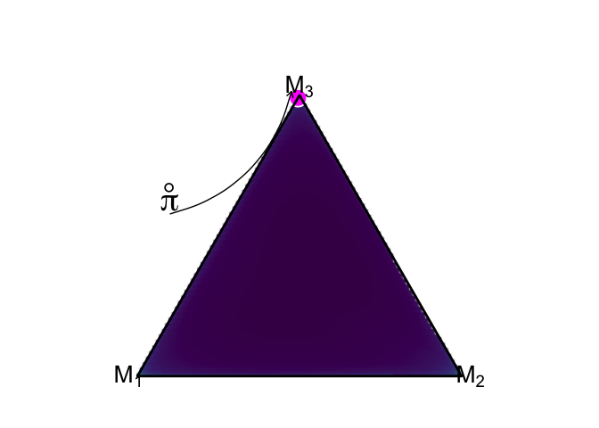

<!-- README.md is generated from README.Rmd. Please edit that file -->

# metabmc

<!-- badges: start -->
<!-- badges: end -->

`metabmc` is an R package to fit and visualize the meta-uncertainty
workflow, as described in the research paper by Schmitt, Radev, &
Bürkner(2023). By augmenting observed data with tailored simulations, we
can mitigate overconfident model selection in the context of Bayesian
model comparison.

## Installation

You can install the development version of `metabmc` directly from the
GitHub source:

``` r
install.packages("devtools")
devtools::install_github("marvinschmitt/metabmc")
```

## How to use metabmc

``` r
library(metabmc)
```

The `metabmc` package uses brms and Stan as a backbone to fit
complicated Bayesian models with a straightforward interface. The entire
computationally intense part of the meta-uncertainty workflow is
encapsulated in the function `metabmc`. We can simply input configured
`brmsfit` objects along with a arguments that specify the simulation
settings.

``` r
metabmc_fit <- metabmc(fit1, fit2, fit3, n_sim=20)
```

### Visualizations

Posterior model probabilities obtained from simulation can be visualized
with the `plot_simulated_pmp()` function:

``` r
plot_simulated_pmp(metabmc_fit)
#> You are using an untested initial demo of {ggsimplex} beware of unexpected behavior and bugs.
```


The posterior predictive distributions of each estimated meta model can
be visualized via the `plot_meta_model_density()` function:

``` r
plot_meta_model_density(metabmc_fit)
```


The visualization of estimated predictive mixture based on observed
posterior model probabilities is implemented in the
`plot_predictive_mixture()` function.

``` r
plot_predictive_mixture(metabmc_fit)
#> Warning in is.na(x): is.na() applied to non-(list or vector) of type
#> 'expression'
```



This is usually the endpoint of a meta-uncertainty analysis, as
described in the original research paper.
